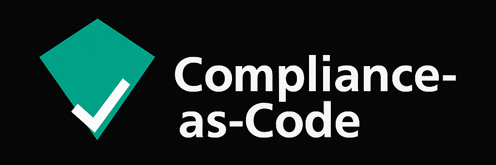
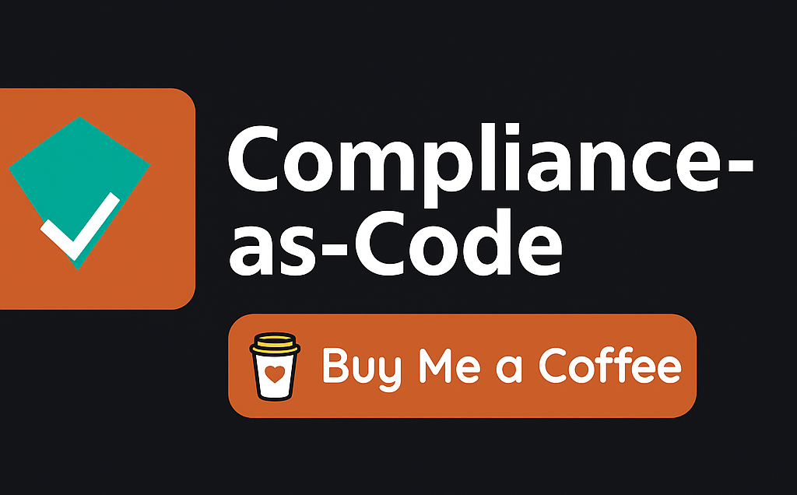

# Compliance-as-Code (CaC)



---

## 🚀 Get Compliance-as-Code

Automate your compliance journey with YAML-based policies, evidence collection, and audit dashboards.  
Choose a subscription tier or a one-time download.

[](https://buy.stripe.com/startup-link)  
[](https://buy.stripe.com/enterprise-link)

---

### ☕ One-Time Ko-fi Purchase

Prefer a single purchase? Get the current version as a direct download.  
*(Future updates require a new purchase or Stripe subscription.)*

[](https://ko-fi.com/YOUR_KOFI_LINK)

---

**Codify compliance. Automate evidence. Stay audit‑ready.**  
Compliance-as-Code (CaC) turns frameworks like SOX, PCI DSS, ISO 27001, and HIPAA into YAML policies that drive automation and audit dashboards.

---

## 🚀 What is CaC?

CaC is a **B2B SaaS** platform that simplifies compliance management:

- **Policy-as-Code**: YAML-based compliance controls.  
- **Automation**: Collect evidence automatically across your systems.  
- **Audit-Ready Dashboards**: Export clean reports for auditors.  
- **Integrations**: Works with your CI/CD, cloud infra, and ticketing tools.

---

## 💳 Pricing & Plans

Choose a subscription tier or a one-time Ko-fi purchase.

### 🟣 Startup — **$99/mo**
- Full YAML policy engine (SOX, PCI, HIPAA, ISO27001)
- Automated evidence collection
- Compliance dashboard access
- Basic integrations (GitHub, GitLab, Jira)

---

### 🟠 Enterprise — **$499/mo**
Everything in Startup, plus:
- Advanced integrations (Atlassian, ServiceNow, cloud APIs)
- Priority roadmap influence
- Premium onboarding & support
- Export-ready auditor packages

---

### ☕ One-Time Ko-fi Purchase — **$15**
- Download current version instantly
- No subscription required  
*(future updates require new purchase or subscription)*

[](https://ko-fi.com/yourlink)

---

## 📊 Compare Plans

| Feature                              | Startup ($99/mo) | Enterprise ($499/mo) |
|--------------------------------------|------------------|-----------------------|
| YAML Policy Engine                   | ✅               | ✅                    |
| Automated Evidence Collection        | ✅               | ✅                    |
| Audit Dashboards & Exports           | ✅               | ✅                    |
| Basic Integrations (GitHub/Jira)     | ✅               | ✅                    |
| Advanced Integrations (Atlassian, etc.) | ❌            | ✅                    |
| Priority Roadmap Influence           | ❌               | ✅                    |
| Premium Onboarding & Support         | ❌               | ✅                    |

---

## ⚡ Quick Install

1. Clone the repo and install dependencies:

   ```bash
   git clone https://github.com/gusinfosec/compliance-as-code.git
   cd compliance-as-code
   pnpm install
   ```

2. Start API (port 4000) & Web (port 3001):

   ```bash
   pnpm --filter cac-api dev
   pnpm --filter cac-web dev
   ```

3. Open browser at `http://localhost:3001`

---

## 📄 License & Privacy

- [LICENSE.md](LICENSE.md) — MIT License  
- [PRIVACY.md](PRIVACY.md) — Our privacy commitment  

---

## 🤝 Support

- 💳 Stripe: Monthly subscriptions (Startup / Enterprise)  
- ☕ Ko-fi: One-time support ($15)  
- GitHub Sponsors: Coming soon  

---

**Compliance-as-Code** — Automating trust, one YAML at a time.
